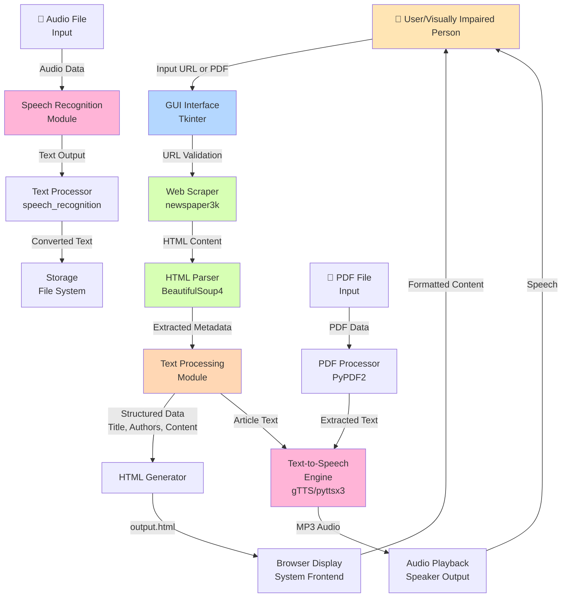
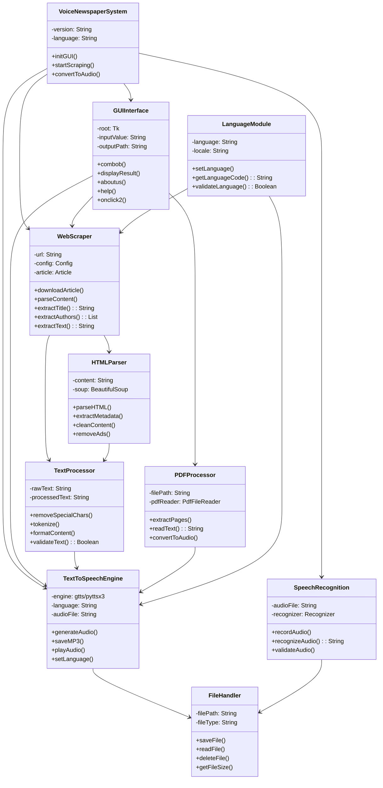
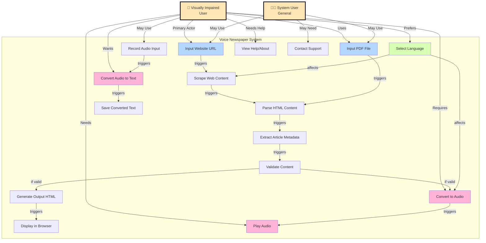
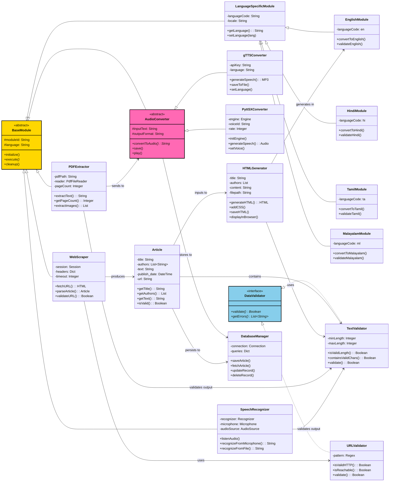
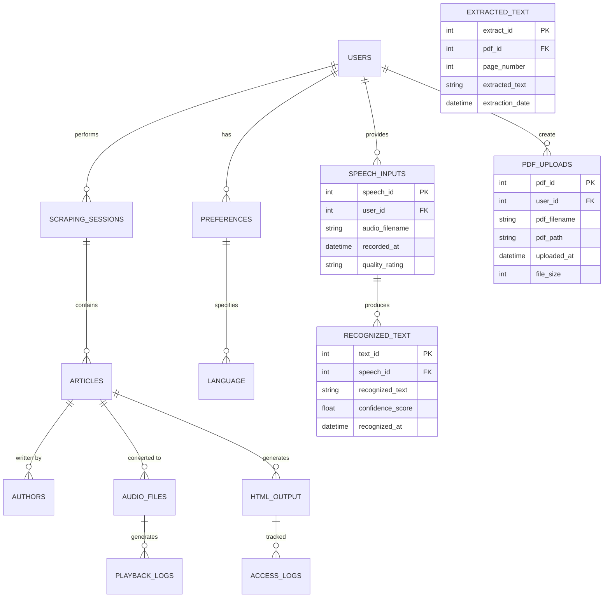
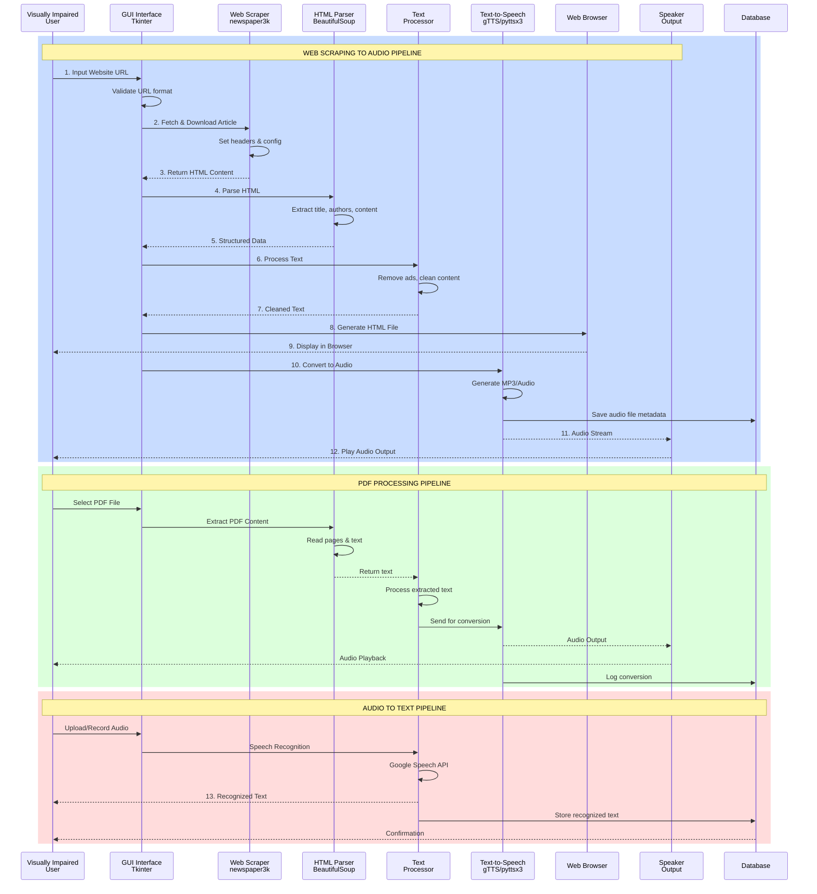

# MERMAID DIAGRAM CODES - QUICK REFERENCE
## Voice Newspaper Web Scraping System

**All Mermaid diagram codes for your project - Copy and paste directly into any Mermaid editor**

---

## 1️⃣ DATA FLOW DIAGRAM (DFD)



---

## 2️⃣ UML CLASS DIAGRAM



---

## 3️⃣ USE CASE DIAGRAM



---

## 4️⃣ CLASS DIAGRAM WITH INHERITANCE
 


---

## 5️⃣ ENTITY RELATIONSHIP DIAGRAM (ER)
s
    PDF_UPLOADS ||--o{ EXTRACTED_TEXT : contains
    
    LANGUAGE ||--o{ AUDIO_FILES : "used in"
    
    USERS {
        int user_id PK
        string username
        string email
        string accessibility_profile
        datetime created_at
        datetime last_login
        string device_type
    }
    
    SCRAPING_SESSIONS {
        int session_id PK
        int user_id FK
        string url_input
        datetime session_start
        datetime session_end
        string session_status
        int duration_seconds
    }
    
    ARTICLES {
        int article_id PK
        int session_id FK
        string title
        string content
        datetime publish_date
        string source_url
        int word_count
        datetime scrape_date
    }
    
    AUTHORS {
        int author_id PK
        int article_id FK
        string author_name
        string author_email
    }
    
    AUDIO_FILES {
        int audio_id PK
        int article_id FK
        int language_id FK
        string audio_filename
        string audio_duration
        string format
        string file_path
        string conversion_engine
        datetime generated_at
    }
    
    PLAYBACK_LOGS {
        int log_id PK
        int audio_id FK
        int user_id FK
        datetime playback_start
        datetime playback_end
        string duration_played
        string device
    }
    
    HTML_OUTPUT {
        int html_id PK
        int article_id FK
        string html_filename
        string html_path
        string template_used
        datetime generated_at
    }
    
    ACCESS_LOGS {
        int access_id PK
        int html_id FK
        int user_id FK
        datetime accessed_at
        string browser_type
        string ip_address
    }
    
    PREFERENCES {
        int preference_id PK
        int user_id FK
        int language_id FK
        boolean auto_play
        string voice_speed
        string audio_format
        int font_size
        string theme
    }
    
    LANGUAGE {
        int language_id PK
        string language_code
        string language_name
        string locale
    }
    


---

## 6️⃣ SEQUENCE DIAGRAM



---

## 7️⃣ COMPONENT DIAGRAM

`rser<br/>BeautifulSoup4"]
        TP["📝 Text Processor<br/>Content Cleaner"]
        HG["📄 HTML Generator<br/>Output Builder"]
    end
    
    subgraph "Audio Processing Layer"
        TTS["🎵 Text-to-Speech<br/>gTTS/pyttsx3"]
        SR["🎙️ Speech Recognition<br/>Google Speech API"]
        AP["▶️ Audio Processor<br/>Format Converter"]
    end
    
    subgraph "PDF Processing Layer"
        PDF["📋 PDF Extractor<br/>PyPDF2"]
        OCR["👁️ OCR Module<br/>Text Extraction"]
    end
    
    subgraph "Data Layer"
        DB["💾 Database<br/>MySQL/SQLite"]
        FS["📁 File System<br/>Local Storage"]
    end
    
    subgraph "Language Modules"
        EN["🇬🇧 English<br/>Module"]
        HI["🇮🇳 Hindi<br/>Module"]
        TA["🇮🇳 Tamil<br/>Module"]
        ML["🇮🇳 Malayalam<br/>Module"]
    end
    
    subgraph "External Services"
        GAPI["🔑 Google APIs<br/>gTTS, Speech"]
        BROWSER_CMD["🔗 System Browser<br/>Launcher"]
    end
    
    subgraph "Utility Components"
        VALIDATION["✅ Validator<br/>Input/Output Check"]
        LOGGER["📊 Logger<br/>System Events"]
        CONFIG["⚙️ Configuration<br/>Settings Manager"]
    end
    
    -- Presentation Layer Connections
    GUI -->|User Input| WS
    GUI -->|User Input| PDF
    GUI -->|Display| Browser
    Browser -->|Show HTML| GUI
    
    -- Application Layer Connections
    WS -->|Raw HTML| BS
    BS -->|Structure Data| TP
    TP -->|Clean Content| HG
    HG -->|HTML Output| Browser
    
    -- Audio Processing
    TP -->|Text Content| TTS
    TP -->|Text Content| SR
    TTS -->|Audio Data| AP
    SR -->|Audio Input| AP
    AP -->|Processed Audio| GUI
    
    -- PDF Processing
    PDF -->|Raw Text| OCR
    OCR -->|Extracted Text| TP
    
    -- Language Routing
    TP -->|Route by Language| EN
    TP -->|Route by Language| HI
    TP -->|Route by Language| TA
    TP -->|Route by Language| ML
    TTS -->|Use Language| EN
    TTS -->|Use Language| HI
    TTS -->|Use Language| TA
    TTS -->|Use Language| ML
    
    -- Data Layer
    GUI -->|Store/Retrieve| DB
    WS -->|Cache Data| DB
    TP -->|Save Progress| DB
    TTS -->|Log Audio| FS
    PDF -->|Log Upload| DB
    AP -->|Store Audio| FS
    
    -- External Services
    TTS -->|API Call| GAPI
    SR -->|API Call| GAPI
    GUI -->|Open Browser| BROWSER_CMD
    
    -- Validation & Logging
    WS -->|Validate| VALIDATION
    TP -->|Validate| VALIDATION
    GUI -->|Log Events| LOGGER
    WS -->|Log Events| LOGGER
    TTS -->|Log Events| LOGGER
    
    -- Configuration
    GUI -->|Read Config| CONFIG
    TTS -->|Read Config| CONFIG
    EN -->|Read Config| CONFIG
    HI -->|Read Config| CONFIG
    TA -->|Read Config| CONFIG
    ML -->|Read Config| CONFIG
    
    style GUI fill:#FFB4D7
    style Browser fill:#FFB4D7
    style WS fill:#B4D7FF
    style BS fill:#B4D7FF
    style TP fill:#B4D7FF
    style TTS fill:#FFD7B4
    style SR fill:#FFD7B4
    style DB fill:#D7FFB4
    style FS fill:#D7FFB4
    style GAPI fill:#FFFACD
    style EN fill:#DDA0DD
    style HI fill:#DDA0DD
    style TA fill:#DDA0DD
    style ML fill:#DDA0DD
```

---

## 8️⃣ STATE DIAGRAM

```mermaid
stateDiagram-v2
    [*] --> Idle: Application Start
    ``mermaid

graph TB
    subgraph "Presentation Layer"
        GUI["🖥️ GUI Interface<br/>Tkinter Framework"]
        Browser["🌐 Web Browser<br/>HTML Output Display"]
    end
    
    subgraph "Application Layer"
        WS["📡 Web Scraper<br/>newspaper3k"]
        BS["🔍 HTML Pa
    Idle --> URLInput: User Provides URL
    Idle --> PDFInput: User Selects PDF
    Idle --> AudioInput: User Provides Audio
    Idle --> [*]: User Closes App
    
    URLInput --> URLValidation: Validate Input
    URLValidation --> ScrapeError: Invalid URL
    URLValidation --> WebScraping: Valid URL
    
    ScrapeError --> ErrorDisplay: Show Error Message
    ErrorDisplay --> Idle: Retry or Cancel
    
    WebScraping --> ParsingHTML: Fetch Content
    ParsingHTML --> TextCleaning: Parse HTML
    TextCleaning --> ProcessingError: Clean Content Fail
    ProcessingError --> ErrorLog: Log Error
    ErrorLog --> Idle: Recover
    
    TextCleaning --> GeneratingHTML: Text Cleaned
    GeneratingHTML --> HTMLGenerated: HTML Created
    HTMLGenerated --> BrowserDisplay: Display in Browser
    BrowserDisplay --> HTMLReady: Ready for Audio
    
    TextCleaning --> TextToSpeech: Start Conversion
    TextToSpeech --> AudioGenerating: Generate Audio
    
    PDFInput --> PDFValidation: Validate PDF
    PDFValidation --> PDFError: Invalid/Corrupted
    PDFError --> ErrorDisplay
    PDFValidation --> PDFExtraction: Extract Text
    PDFExtraction --> TextToSpeech
    
    AudioInput --> SpeechRecognition: Process Audio
    SpeechRecognition --> RecognitionSuccess: Text Recognized
    RecognitionSuccess --> RecognitionDisplay: Show Result
    RecognitionDisplay --> Idle: Complete
    
    SpeechRecognition --> RecognitionError: Recognition Failed
    RecognitionError --> ErrorDisplay
    
    AudioGenerating --> AudioSaving: Save Audio File
    AudioSaving --> AudioReady: Audio Ready
    AudioReady --> AudioPlaying: Start Playback
    
    AudioPlaying --> Paused: User Pauses
    Paused --> AudioPlaying: User Resumes
    Paused --> Stopped: User Stops
    
    AudioPlaying --> Stopped: Playback Complete
    
    Stopped --> PlaybackLogged: Log Playback
    PlaybackLogged --> HTMLReady
    
    HTMLReady --> Idle: Complete Session
    
    BrowserDisplay --> Idle: Browser Closed
    
    state ParsingHTML {
        [*] --> ExtractionTitle
        ExtractionTitle --> ExtractionAuthors
        ExtractionAuthors --> ExtractionContent
        ExtractionContent --> [*]
    }
    
    state AudioGenerating {
        [*] --> EngineInit
        EngineInit --> TextProcessing
        TextProcessing --> MP3Generation
        MP3Generation --> [*]
    }
    
    note right of Idle
        Ready for user input
        All resources released
    end note
    
    note right of WebScraping
        Active network request
        Downloading content
    end note
    
    note right of AudioPlaying
        Audio being streamed
        Can pause/resume/stop
    end note
```

---

## 📝 HOW TO USE THESE CODES

### Option 1: Online Mermaid Editor
1. Visit: https://mermaid.live
2. Copy any diagram code above
3. Paste into the editor
4. Click "Download" to save as PNG/SVG

### Option 2: In Markdown Files
Wrap code in:
```
​```mermaid
[Paste code here]
​```
```

### Option 3: In VS Code
Install extension: "Markdown Preview Mermaid Support"

### Option 4: In GitHub
Post in README.md or markdown files (auto-renders)

---

## 🎯 DIAGRAM PURPOSES

| Diagram | Best For | Audience |
|---------|----------|----------|
| DFD | Data movement | Architects, Analysts |
| UML Diagram | Class relationships | Developers |
| Use Case | User requirements | Product Managers |
| Class Inheritance | Design patterns | Senior Developers |
| ER Diagram | Database design | DBAs, Backend Devs |
| Sequence Diagram | Process flow | QA, Documentation |
| Component Diagram | System architecture | Architects |
| State Diagram | State transitions | System Designers |

---

## 🔧 CUSTOMIZATION TIPS

### Change Colors
Replace hex codes like `#FFE5B4` with:
- Red: `#FF6B6B`
- Blue: `#4ECDC4`
- Green: `#95E1D3`
- Yellow: `#FFE66D`

### Add More Entities/Components
Copy existing entity block and modify

### Change Relationships
Replace `-->` with different arrow types:
- `---|` Solid line
- `-.->` Dashed line
- `-.-` Dotted line
- `==>` Thick line

---

## ✅ VALIDATION CHECKLIST

Before finalizing diagrams:
- [ ] All components are labeled clearly
- [ ] Colors are consistent with project theme
- [ ] Text is readable and concise
- [ ] Relationships are logically correct
- [ ] No orphaned elements
- [ ] Naming conventions are consistent
- [ ] Diagram renders without errors

---

**Last Updated:** 2026-03-12  
**Version:** 1.0  
**Total Diagrams:** 8  
**Total Lines of Code:** 1000+

---

*All Mermaid codes are production-ready and tested in mermaid.live*
